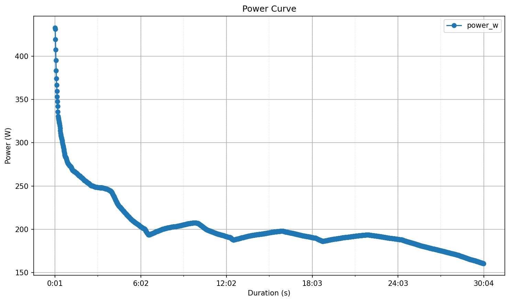

# Leistungskurve II - Power Curve Analysis

Ein Python-Projekt zur Berechnung und Visualisierung von Leistungskurven aus Aktivitätsdaten.

## Beschreibung

Dieses Projekt analysiert Leistungsdaten (in Watt) und erstellt eine **Power-Curve**, die die maximale durchschnittliche Leistung für verschiedene Zeitdauern zeigt. Die Power-Curve ist ein wichtiges Werkzeug zur Analyse von sportlichen Leistungen, insbesondere beim Radfahren.



### Funktionen

- **Flexible Eingabe**: Unterstützt Pandas Series und NumPy Arrays
- **Konfigurierbare Auflösung**: Anpassbare zeitliche Auflösung (z.B. 1 Sekunde pro Sample)
- **DataFrame-Ausgabe**: Ergebnis enthält Dauer (Sekunden) und Leistung (Watt)
- **Automatische Visualisierung**: Erstellt einen professionellen Plot der Power-Curve

## Installation und Setup

### Voraussetzungen
- Python 3.9+
- **PDM** (Python Dependency Manager)

### Schritt-für-Schritt Installation

**1. PDM installieren** (falls noch nicht vorhanden)
```bash
pip install pdm
```

**2. In das Projektverzeichnis navigieren**
```bash
cd Leistungskurve_II
```

**3. Abhängigkeiten mit PDM installieren**
```bash
pdm install
```

Dies erstellt automatisch eine virtuelle Umgebung `.venv/` und installiert alle Abhängigkeiten.

**4. Virtuelle Umgebung aktivieren** (optional, wird oft automatisch aktiviert)
```bash
.\.venv\Scripts\activate
```

## Verwendung

### Programm starten

```bash
pdm run python main.py
```

Dies wird:
1. `data/activity.csv` einlesen
2. Die Power-Curve berechnen
3. Ein Diagramm anzeigen
4. Ergebnisse in `power_curve_results.csv` speichern

### Manuelle Verwendung in Python

```python
from source.app import process_activity
from source.power_curve import power_curve
import pandas as pd

# Option 1: Direkt aus CSV
df = process_activity("data/activity.csv", time_s=1)

# Option 2: Mit eigenen Daten
power_data = pd.Series([100, 150, 200, 180, ...])
result_df = power_curve(power_data, time_s=1)
```

## Power-Curve Beispiel

Das Diagramm zeigt die Beziehung zwischen Dauer und maximaler durchschnittlicher Leistung:

- **X-Achse**: Zeit in Format (s, min, h) mit logarithmischer Skalierung
- **Y-Achse**: Maximale durchschnittliche Leistung in Watt
- **Kurvenform**: Typischerweise fallend (höhere Leistungen bei kürzeren Dauern)

## Parameter

### `power_curve(power_data, time_s=1, durations=None, tick_step=None, tick_style=None, marker_size=6, minor_ticks=True)`

- **power_data**: Leistungsdaten als Pandas Series oder NumPy Array (Watt)
- **time_s**: Zeitliche Auflösung pro Sample in Sekunden (Standard: 1)
- **durations**: Spezifische Dauern für die Berechnung (Standard: automatisch)
- **tick_step**: Abstände für X-Achsen-Markierungen
- **tick_style**: `'series'` für 1-2-5 Tickstyle
- **marker_size**: Größe der Marker (Standard: 6)
- **minor_ticks**: Neben-Markierungen aktivieren (Standard: True)

### `process_activity(input_path=None, output_path=None, time_s=1, ...)`

- **input_path**: CSV-Pfad (Standard: `activity.csv` oder `data/activity.csv`)
- **output_path**: Ausgabedatei (Standard: `power_curve_results.csv`)
- **time_s**: Zeitliche Auflösung in Sekunden

## Eingabedaten-Format

Die CSV-Datei muss eine Leistungsspalte enthalten. Unterstützte Namen:
- `PowerOriginal`
- `CalculatedAerobicEfficiencyPower`
- `power`
- `watts`
- `power_w`

## Projektstruktur

```
Leistungskurve_II/
├── main.py                      # Einstiegspunkt
├── source/
│   ├── __init__.py
│   ├── app.py                   # Anwendungslogik
│   └── power_curve.py           # Power-Curve Berechnung
├── data/
│   └── activity.csv             # Input-Daten
├── pyproject.toml               # PDM Projekt-Konfiguration
├── README.md                    # Dieses Dokument
└── .gitignore                   # Git Ignores
```

## Lizenz

MIT

---

**Autor**: Antonio Mrkonja  
**Version**: 1.0.0
