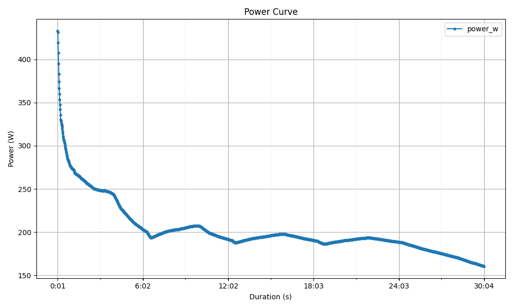

# Leistungskurve II – Power Curve Analysis

Ein Python-Projekt zur Berechnung und Visualisierung von Leistungskurven aus Aktivitätsdaten.

## Beschreibung

Dieses Projekt analysiert Leistungsdaten (in Watt) und erstellt eine **Power-Curve**, die die maximale durchschnittliche Leistung für verschiedene Zeitdauern zeigt. Die Funktion ist auf beliebige Leistungsdaten als Pandas Series oder NumPy Array anwendbar.



## Funktionen

- **Flexible Eingabe**: Unterstützt Pandas Series und NumPy Arrays
- **Konfigurierbare Auflösung**: Anpassbare zeitliche Auflösung (z.B. 1 Sekunde pro Sample)
- **DataFrame-Ausgabe**: Ergebnis enthält Dauer in Sekunden (`duration_s`) und Leistung in Watt (`power_w`)
- **Zoneneinteilung**: Auswertung für feste Zeitbereiche – 1 s, 5 s, 10 s, 20 s, 1 min, 5 min, 20 min, 30 min
- **Automatische Visualisierung**: Plot der Power-Curve wird erstellt und gespeichert

## Voraussetzungen

- Python 3.9+
- **PDM** (Python Dependency Manager)

## Installation

PDM installieren (falls noch nicht vorhanden):

```bash
pip install pdm
```

In das Projektverzeichnis wechseln und Abhängigkeiten installieren:

```bash
cd Leistungskurve_II
pdm install
```

## Programm starten

```bash
pdm run python main.py
```

Das Programm liest `data/activity.csv` ein, berechnet die Power-Curve, zeigt einen Plot an und speichert die Ergebnisse als CSV.

## Ausgabe

| Datei | Inhalt |
|---|---|
| `power_curve_results.csv` | Vollständige Power-Curve (alle Sekunden) |
| `power_curve_results_zones.csv` | Zonenwerte: 1 s, 5 s, 10 s, 20 s, 1 min, 5 min, 20 min, 30 min |

## Manuelle Verwendung

```python
from source.power_curve import power_curve
import pandas as pd

# Mit eigenen Daten
power_data = pd.Series([100, 150, 200, 180, 220, 195])
result_df = power_curve(power_data, time_s=1)
print(result_df)
```

## Eingabedaten

Die CSV-Datei muss eine Leistungsspalte enthalten. Unterstützte Spaltennamen:

- `PowerOriginal`
- `power`
- `watts`
- `power_w`

## Projektstruktur

```
Leistungskurve_II/
├── main.py                  # Einstiegspunkt
├── source/
│   ├── __init__.py
│   ├── app.py               # Anwendungslogik
│   └── power_curve.py       # Power-Curve Berechnung
├── data/
│   └── activity.csv         # Eingabedaten
├── images/
│   └── screenshot.png       # Screenshot der Power-Curve
├── pyproject.toml           # PDM Projektkonfiguration
├── README.md
└── .gitignore
```

## Algorithmus & Laufzeit

Die Power-Curve wird berechnet, indem für jede gewünschte Dauer *t* alle gleitenden Fenster dieser Länge über die Leistungsdaten berechnet werden und das Maximum davon gespeichert wird. Mit kumulativer Summierung (Prefix Sum) lässt sich jedes Fenster in O(1) auswerten, sodass die Gesamtlaufzeit bei *k* Dauern und *n* Samples bei **O(n · k)** liegt.

---

**Autoren**: Antonio Mrkonja, Noah Reinermann, Lenn Oßwald
